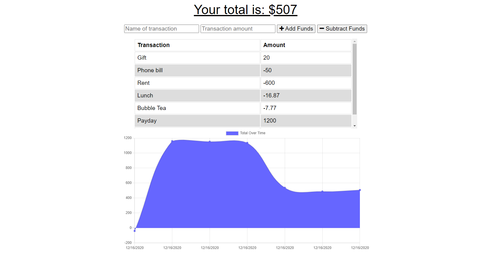

# Budget Tracker

:link: [Go to the Budget Tracker](https://hidden-taiga-29176.herokuapp.com/)

A progressive web application that helps you keep track of your spending. When funds are added or subtracted, transactions are saved in a table and visualized with a graph.

When adding transactions offline, the data is saved in IndexedDB and sent when the browser comes back online.

Acceptance criteria, a user story and starter code were provided for this assignment. The starter code included the working app, but without offline functionality.

## Purpose

For avid travellers who need to keep their account balance accurate while travelling.

## Local Installation

1. Run `npm install` before using the application locally.
2. After making any changes to [`public/assets/js`](./public/assets/js) or any files affected by the `entry` file(s) in [`webpack.config.js`](webpack.config.js), run `npm run build` before starting the server.

## Built with

### Front-End

- [Font Awesome](https://fontawesome.com/v4.7.0/)

### Back-End

- [Node.js](https://nodejs.org/en/)
- [Mongoose](https://mongoosejs.com/)
- [Express](https://expressjs.com/)

### Bundler

- [Webpack](https://webpack.js.org/)

## License

This project is licensed under the **MIT License**.
